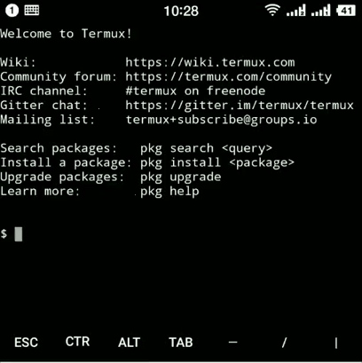

## termux_launcher
>  在[termux](https://termux.com/help.html)中运行的服务启停工具

## 使用方法

### 启用 termux-chroot

1. 安装 termux-exec .

    `$ pkg install termux-exec`
    
1. 在/home目录添加.bash_profile文件，内容如下

    `if ! pgrep -f "proot" >/dev/null ; then termux-chroot ;fi`

1. 关闭 termux APP 重新启动

### 安装 nodejs

    $ pkg install node

### 下载

    $ git clone https://github.com/mescp/termux_launcher.git
    
### 安装依赖

    $ cd termux_launcher
    $ npm install
    
### 初始化

    $ npm link
    
## 启动

    $ launcher

